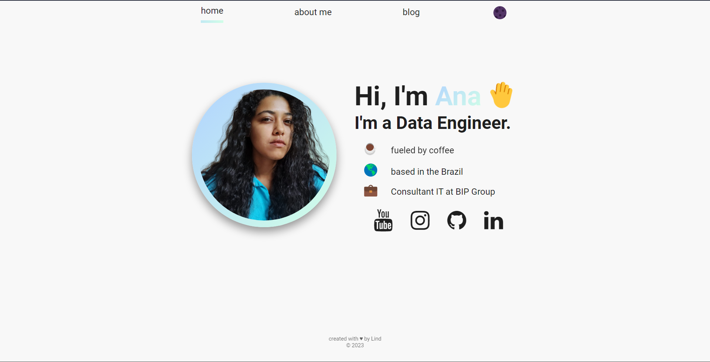

## :memo: Descrição
o projeto consiste em um site portifolio em React com multiple pages e dark mode.

## :wrench: Tecnologias utilizadas
* React;
* Node js;
* NPM / yarn;

## :rocket: Rodando o projeto
pré-requisitos
- tenha o Git instalado em sua máquina
- tenha o Node.js instalado em sua máquina
- familiaridade básica com a linha de comando da sua máquina
- compreensão básica do esboço de dados JSON (basicamente matrizes de objetos)

Como usar
- clone localmente o repositorio
- cd no projeto e execute `npm install` para instalar as dependências
- assim que a instalação estiver concluída, execute `npm run start ` para obter sua cópia local em execução no navegador.

## Referências 

<a href="https://www.paytonpierce.dev/" > Payton pierce </a>
